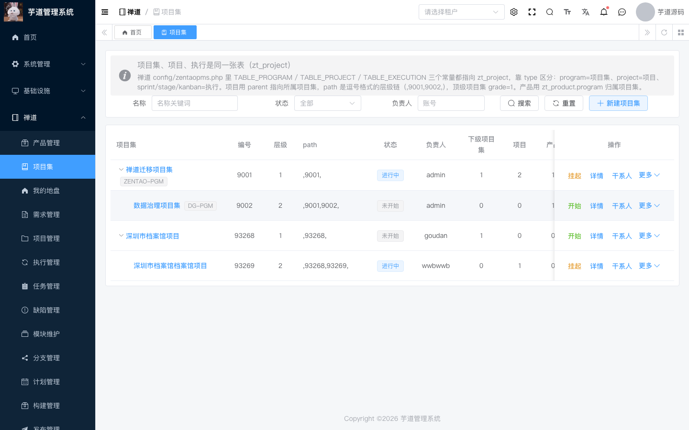
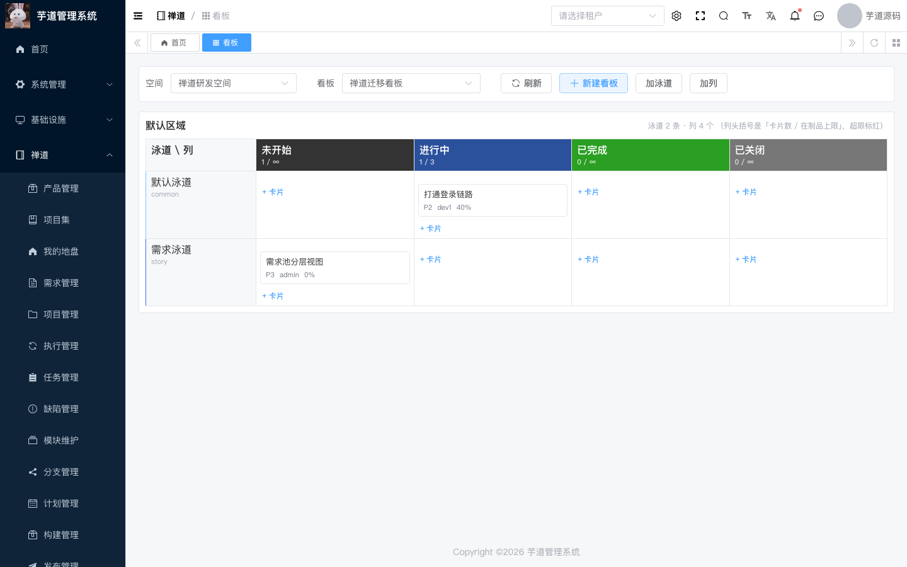
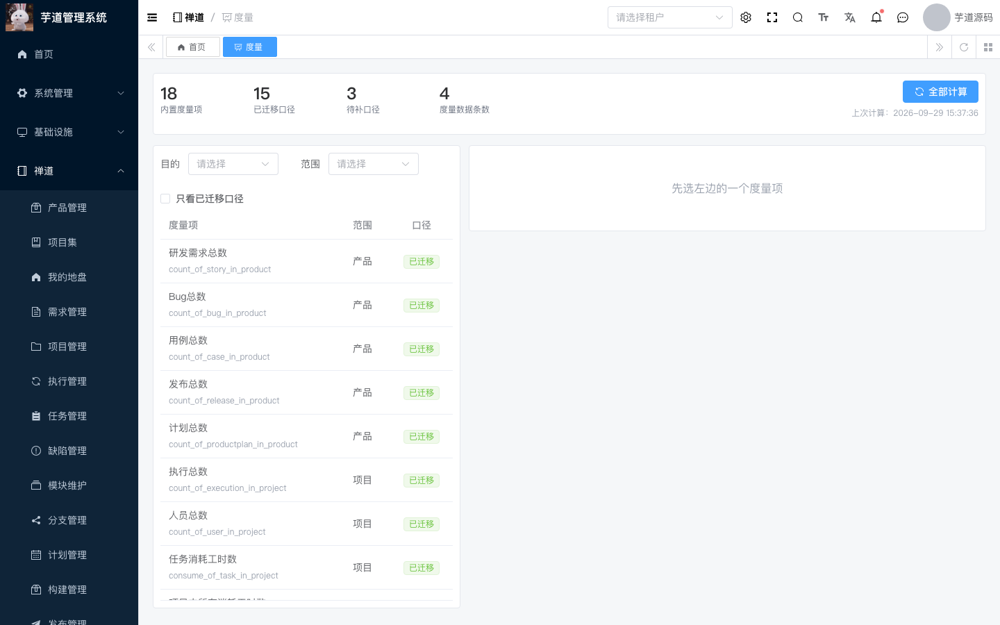
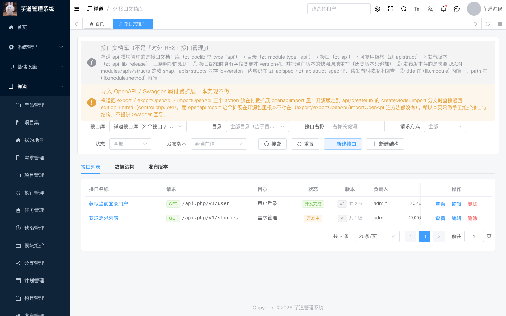

<div align="center">

# openpm

**An open-source R&D collaboration platform that re-implements ZenTao's business rules on Java + Vue 3**

Product · Project · Execution · Story · Task · Bug · Test · Doc · Effort · Kanban · Metric · BI · Report

[](https://github.com/OceanHAN/openpm/actions/workflows/ci.yml)
[](LICENSE)
[](https://openjdk.org/)
[](https://spring.io/projects/spring-boot)
[](https://vuejs.org/)
[](#testing--verification)

<sub><a href="README.md">中文</a> · <a href="README.en.md">English</a></sub>

</div>

---

## What is this

**openpm** is a Java rewrite of a software R&D management platform whose business rules follow
[ZenTao](https://github.com/easysoft/zentaopms). It is built on top of
[yudao / ruoyi-vue-pro](https://github.com/YunaiV/ruoyi-vue-pro) and keeps ZenTao's `zt_*` table
naming and column semantics.

In one sentence: **the same R&D management process, on a Java + MySQL + Vue 3 stack, with rules
kept as close to 1:1 as possible.** Every rule can be traced back to a location in ZenTao's source;
intentional deviations are documented one by one in the
[implementation notes](docs/IMPLEMENTATION-NOTES.md) (Chinese).

### What it is not

- **Not affiliated with ZenTao** (Qingdao EasySoft). This repository contains **no ZenTao source
  code** — it is not a fork and does not copy files from it.
- **Not a line-by-line PHP→Java translation**: business rules are mirrored, implementation is
  rewritten with idiomatic Java (MyBatis-Plus, Spring transactions, Jackson 3 …).
- **Not a hosted SaaS**: it is meant to be self-hosted; you provide MySQL 8, Redis 7 and a build
  environment.

> "ZenTao" is a trademark of its owner. The name is only used here to describe compatibility.

## Screenshots

| Program (program / project / execution share one table) | Kanban |
|---|---|
|  |  |

| Metric | API doc library |
|---|---|
|  |  |

Two more (story list, task list) live in [`docs/images/`](docs/images/).

## Features

| Area | Capabilities |
|---|---|
| Core chain | Product, product plan, program, project, execution (sprint / stage), story (business/user/dev layering + version chain), task (incl. multi-assignee), bug, build, release |
| Quality chain | Test case, case library, test task, test report, QA dashboard, automatic bug-resolution → build/release sync |
| Collaboration | Doc library, attachments, effort logs, team, stakeholders, kanban, todo & "my workspace", action log & recycle bin |
| Metrics & analysis | Metric framework (definitions + snapshots), data views (guarded SQL), charts, reports, execution burndown |
| System & integration | Organization/permissions (framework RBAC with a ZenTao-style view), repositories (local git sync + commit links), holidays & working-day rules, third-party sign-in entry, company info, points, saved queries, metric dimensions, API doc library, webhooks |

The UI is Chinese; after login everything sits under the "禅道" menu group in the sidebar.

## Tech stack

| Layer | Choice |
|---|---|
| Backend | Java 25 · Spring Boot 4.1 · MyBatis-Plus · MySQL 8 · Redis 7 (`ruoyi-vue-pro/yudao-module-zentao`) |
| Frontend | Vue 3 · TypeScript · Element Plus · Vite (`yudao-ui-admin-vue3`) |
| Deployment | Docker Compose (MySQL / Redis) + systemd (backend jar / vite dev server) |

Scale: **537 Java files / ~57k lines** in the ZenTao backend module, **130 files / ~24k lines** of
frontend, **67 `zt_*` tables**.

## Quick start

### Prerequisites

- JDK 25, Maven 3.9+
- Node 20+ with pnpm
- Docker (for MySQL 8 and Redis 7)

### 1. Start dependencies

```bash
git clone https://github.com/OceanHAN/openpm.git && cd openpm
cp deploy/.env.example deploy/.env          # set MYSQL_PASS / REDIS_PASS
cd deploy && docker compose up -d && cd ..
```

### 2. Create the database

```bash
set -a; . deploy/.env; set +a
docker exec -i yudao-mysql mysql -uroot -p"$MYSQL_PASS" --default-character-set=utf8mb4 \
  < deploy/sql/01-ruoyi-vue-pro.sql
# then import 02..56 in order (all idempotent); see deploy/README.md
```

### 3. Start the backend

```bash
cd ruoyi-vue-pro
mvn -pl yudao-server -am package -DskipTests
java -jar yudao-server/target/yudao-server.jar \
  --spring.profiles.active=local \
  --spring.datasource.dynamic.datasource.master.url="jdbc:mysql://127.0.0.1:3307/ruoyi-vue-pro?useSSL=false&serverTimezone=Asia/Shanghai" \
  --spring.datasource.dynamic.datasource.master.username=yudao \
  --spring.datasource.dynamic.datasource.master.password="$MYSQL_PASS" \
  --spring.data.redis.host=127.0.0.1 --spring.data.redis.port=6380 --spring.data.redis.password="$REDIS_PASS"
```

### 4. Start the frontend

```bash
cd yudao-ui-admin-vue3
pnpm install
cp .env.local.example .env.local      # point VITE_BASE_URL at the backend
pnpm dev
```

Open <http://localhost:8081> and sign in with `admin / admin123`.

> ⚠️ `admin123` is a demo default. Change it before exposing the service, and keep 3307/6380
> behind a firewall.

## Testing & verification

Verification here is scripted and reproducible, not "clicked through once":

```bash
# one API regression suite (43 suites / 1704 assertions in total)
ZENTAO_API_BASE=http://<host>:48080/admin-api bash deploy/test-story-module.sh

# 21-page sweep + 20 browser suites (Playwright)
ZENTAO_UI_BASE=http://<host>:8081 node deploy/ui-check/all-pages.mjs

# everything: sync SQL → restart services → API regression → browser checks
bash deploy/resume-verification-remote.sh
```

| Item | Scale |
|---|---|
| API regression | **43 suites / 1704 assertions** |
| Page sweep | **21 pages** |
| Browser suites | **20** (team, kanban, metric, BI, burndown, repo, webhook …) |
| Static pre-checks | reserved words, camel-case columns, tenant-ignore tables |

CI runs the backend build, the full API regression against MySQL 8 + Redis 7 service containers,
and the 21-page Playwright sweep — see [.github/workflows/ci.yml](.github/workflows/ci.yml).

## Status

ZenTao's open-source edition has 99 modules; coverage here (evidence in the
[module feasibility audit](docs/MODULE-FEASIBILITY-AUDIT.md)):

| Status | Modules | Notes |
|---|---|---|
| ✅ Implemented | **48** | core chain, delivery chain, quality chain, metric/BI … |
| 🚧 Partial | 4 | `metric` (framework + 15 metrics), `bi` (SQL mode only), `common`, `block` |
| ⛔ Not migrated | 47 | 23 have no open-source implementation to port, 6 depend on external services, 18 are already covered by framework capabilities (approval → workflow engine, mail/notify → system notifications, …) |

**Roadmap**: remaining metric formulas and BI pivot tables → bulk actions and import/export on more
list pages → notification pipeline → production deployment shape (static frontend, reverse proxy, backups).

## Documentation

Most documents are in Chinese.

| Document | Content |
|---|---|
| [Implementation notes](docs/IMPLEMENTATION-NOTES.md) | module-by-module rule mapping, architecture decisions, **58 pitfalls** |
| [Migration inventory](docs/MIGRATION-INVENTORY.md) | per-module status and rationale for all 99 modules |
| [Module feasibility audit](docs/MODULE-FEASIBILITY-AUDIT.md) | what can be migrated, what should not be, what has no implementation to port |
| [Map-only modules](docs/MAP-ONLY-MAPPINGS.md) | 10 modules already covered by framework capabilities |
| [Remaining module verdicts](docs/REMAINING-MODULE-VERDICTS.md) | evidence for the last 24 modules |
| [deploy/README.md](deploy/README.md) | how to run deployment and verification scripts |
| [SECURITY.md](SECURITY.md) · [CHANGELOG.md](CHANGELOG.md) | security policy · change log |

## Contributing

Issues and PRs are welcome. Please read [CONTRIBUTING.md](CONTRIBUTING.md) (Chinese) first — it
covers the branch/commit conventions, the checks to run before pushing, and the checklist for
adding a module.

## License

[AGPL-3.0](LICENSE).

This project contains no ZenTao source code, but its **table structure and business rules follow
ZenTao**. ZenTao is dual-licensed under ZPL 1.2 / AGPL, so AGPL-3.0 is chosen here for
compatibility. If that conflicts with your use case, please open an issue.

## Credits

- [ZenTao](https://github.com/easysoft/zentaopms) — the source of the business rules
- [yudao / ruoyi-vue-pro](https://github.com/YunaiV/ruoyi-vue-pro) — the technical foundation
- [Element Plus](https://element-plus.org/) · [Vue](https://vuejs.org/) · [MyBatis-Plus](https://baomidou.com/) · [Playwright](https://playwright.dev/)
